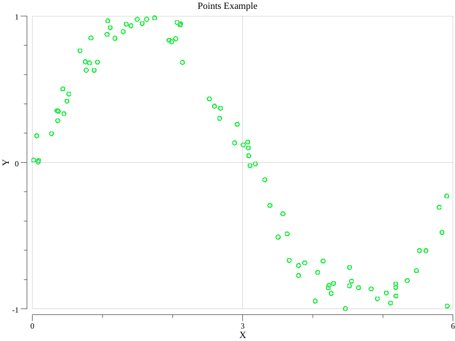
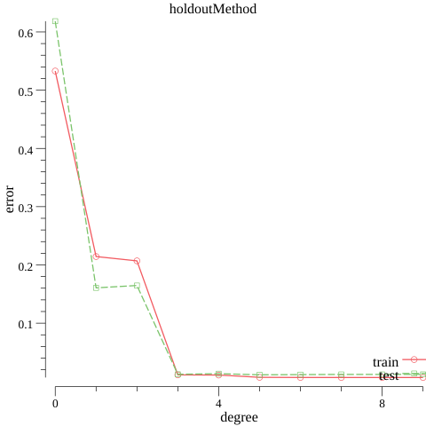

# はじパタ二章

golang で実装してみました。

- [○]　 holdout
- [ ]　 crossValidation
- [ ]　一つ抜き法
- [ ]　ブートストラップ法

## Getting Start

golang の導入
https://golang.org/doc/install

## 動作環境

```
>>> go version
go version go1.14.5 darwin/amd64
```

## 動作

```
make build
```

## 実行例




